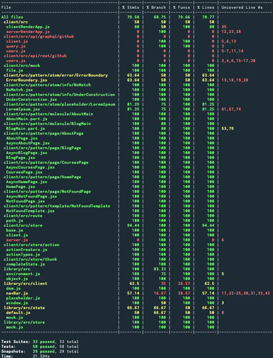

  

<h1 align="center">MTS</h1>

  

  

  

  

  

  

  

<h2 style="color: #006400;">🗿 Status</h2>

<blockquote style="margin: 0; padding: 0 24px; color: olive; font-weight: 600; font-size:1em">🐝 This project is a work in progress and is not ready for production use yet!</blockquote>

<h2 style="color: #006400;">🗿 Introduction</h2>

<blockquote style="margin: 0; padding: 0 24px; color: olive; font-weight: 600; font-size:1em">🐝 Sharing is caring. Following is a collection of concepts which any maintainer needs to master in order to gracefully maintain this project and scale its implementation along with its unit and integration tests.</blockquote>

<h2 style="color: #006400;">🗿 Concepts</h2>

  
 📗 JavaScript Runtime

  <blockquote style="margin: 0; padding: 0 24px">
    

      
Node.js

      <blockquote style="margin: 0; padding: 0 24px">
        

          
📜 Node

          <blockquote style="margin: 0; padding: 0 24px">
            <ul>
              <li><strong>Package(s): </strong><a style="color: #006400;" href="https://github.com/nodejs/node">node</a> repository on GitHub</li>
              <li><strong>Information: </strong>Node is required to bootstrap the project. Linting, formatting, testing and building scripts run all on Node.</li>
            </ul>
          </blockquote>
        

      </blockquote>
    

  </blockquote>

  
 📗 Version Control

  <blockquote style="margin: 0; padding: 0 24px">
    

      
Git (self)

      <blockquote style="margin: 0; padding: 0 24px">
        

        
📜 Git

          <blockquote style="margin: 0; padding: 0 24px">
            <ul>
              <li><a style="color: #006400;" href="https://git-scm.com/">Git</a> distributed version control system</li>
              <li><a style="color: #006400;" href="https://www.atlassian.com/git/tutorials/learn-git-with-bitbucket-cloud">Git Commands</a> documentation by Atlassian</li>
              <li><strong>Information: </strong>Project source code is maintained in a Git repository. Using Git commands through the command prompt or a Git Client is essential.</li>
            </ul>
          </blockquote>
        

      </blockquote>
    

    

      
Git Hooks

      <blockquote style="margin: 0; padding: 0 24px">
        

        
📜 Using Git Hooks

          <blockquote style="margin: 0; padding: 0 24px">
            <ul>
              <li><strong>Package(s): </strong><a style="color: #006400;" href="https://github.com/typicode/husky">husky</a> repository on GitHub</li>
              <li><strong>Setup file(s): </strong><a style="color: #006400;" href="https://github.com/mts/mts/blob/master/.huskyrc">.huskyrc</a></li>
              <li><strong>Script(s) in project's package.json: </strong>n/a</li>
              <li><strong>Information: </strong>Husky utilizes Git hooks such as pre-commit and pre-push</li>
            </ul>
          </blockquote>
        

        

          
📜 Running linters and testers against staged git files

          <blockquote style="margin: 0; padding: 0 24px">
            <ul>
              <li><strong>Package(s): </strong><a style="color: #006400;" href="https://github.com/okonet/lint-staged">lint-staged</a> repository on GitHub</li>
              <li><strong>Setup file(s): </strong><a style="color: #006400;" href="https://github.com/mts/mts/blob/master/.lintstagedrc">.lintstagedrc</a></li>
              <li><strong>Script(s) in project's package.json: </strong>n/a</li>
              <li><strong>Information: </strong>lint-staged runs linters and testers against staged git files. Using lint-staged combined with husky and thus targeting pre-commit and pre-push Git hooks prevents source code not conforming to linting rules and formatting style being committed or pushed to the Git repository's origin</li>
            </ul>
          </blockquote>
        

      </blockquote>
    

    

      
Git Client

      <blockquote style="margin: 0; padding: 0 24px">
        

          
📜 Git Kraken

          <blockquote style="margin: 0; padding: 0 24px">
            <ul>
              <li><a style="color: #006400;" href="https://www.gitkraken.com/">Website</a></li>
              <li><strong>Information: </strong>The coolest, the finest and the best Git client in the world 👌 Over 1.5 Million GitKraken Users❗</li>
            </ul>
          </blockquote>
        

        

          
📜 Sourcetree

          <blockquote style="margin: 0; padding: 0 24px">
            <ul>
              <li><a style="color: #006400;" href="https://www.sourcetreeapp.com/">Website</a></li>
              <li><strong>Information: </strong>Sourcetree simplifies how you interact with your Git repositories so you can focus on coding. Visualize and manage your repositories through Sourcetree's simple Git GUI.</li>
            </ul>
          </blockquote>
        

      </blockquote>
    

  </blockquote>

  
 📗 Bootstrap

  <blockquote style="margin: 0; padding: 0 24px">
    

      
Install

      <blockquote style="margin: 0; padding: 0 24px">
        <strong>Run </strong><kbd>rm -rf node_modules package-lock.json && npm install</kbd> for 
        <kbd>repository root</kbd>, <kbd>packages/http-server folder</kbd> and <kbd>packages/client folder</kbd> 
        to remove node_modules directory, package-lock.json file and install all packages from scratch
      </blockquote>
    

    

      
Bootstrap

      <blockquote style="margin: 0; padding: 0 24px">
        <strong>Run </strong><kbd>npm run bootstrap</kbd>
        to run linting, formatting, testing and building sequentially
      </blockquote>
    

    

      
Start

      <blockquote style="margin: 0; padding: 0 24px">
        <strong>Run </strong><kbd>npm start</kbd> in 1st terminal in packages/http-server folder to start up http-server 
        <strong>Run </strong><kbd>npm start</kbd> in 2nd terminal in packages/client to start up webpack-dev-server 
        <strong>Run </strong><kbd>npm run test -- --watch --onlyChanged --verbose</kbd> in 3rd terminal to let Jest watch changed tests 
      </blockquote>
    

    

      
Dynamic Code Splitting

      <blockquote style="margin: 0; padding: 0 24px">
        <ul>
          <li>Babel enables parsing dynamic imports through <a style="color: #006400;" href="https://babeljs.io/docs/en/babel-plugin-syntax-dynamic-import">@babel/plugin-syntax-dynamic-import</a> since <a style="color: #006400;" href="https://babeljs.io/blog/2019/07/03/7.5.0">v7.5.0</a></li>
          <li>Webpack recommends this <a style="color: #006400;" href="https://webpack.js.org/guides/code-splitting/#dynamic-imports">technique</a> instead of the legacy webpack-specific approach through optimization.splitChunks configuration option.
          </li>
        </ul>
      </blockquote>
    

  </blockquote>

  
 📗 Code Style

  <blockquote style="margin: 0; padding: 0 24px">
    

      
Code Linting

      <blockquote style="margin: 0; padding: 0 24px">
        

          
📜 JavaScript

          <blockquote style="margin: 0; padding: 0 24px">
            <ul>
              <li><strong>Package(s): </strong>
                <ul>
                  <li><a style="color: #006400;" href="https://github.com/eslint/eslint">eslint</a> repository on GitHub</li>
                  <li><a style="color: #006400;" href="https://github.com/SublimeLinter/SublimeLinter-eslint">SublimeLinter-eslint</a> for Sublime Text</li>
                  <li><a style="color: #006400;" href="https://github.com/microsoft/vscode-eslint">vscode-eslint</a> for Visual Studio Code</li>
                  <li><a style="color: #006400;" href="http://plugins.jetbrains.com/plugin/7494-eslint">eslint plugin</a> for Webstorm and ItelliJ</li>
                </ul>
              </li>
              <li><strong>Setup file(s):</strong>
                <a style="color: #006400;" href="https://github.com/mts/mts/blob/master/.eslintrc">.eslintrc</a>,
                <a style="color: #006400;" href="https://github.com/mts/mts/blob/master/.eslintignore">.eslintignore</a>
              </li>
              <li><strong>JavaScript Style Guide(s):</strong>
                <a style="color: #006400;" href="https://github.com/airbnb/javascript">AirBnb JavaScript Style Guide</a>,
                <a style="color: #006400;" href="https://github.com/airbnb/javascript/tree/master/react">Airbnb React/JSX Style Guide</a>
              </li>
              <li><strong>Script(s) in project's package.json:</strong>
                <ul>
                  <li>"lint:format": "npm-run-all lint format"</li>
                  <li>"lint": "npm-run-all lint:js:jsx lint:scss"</li>
                  <li>"lint:js:jsx": "eslint --ext .js --ext .jsx packages/**/src --fix"</li>
                </ul>
              </li>
              <li><strong>Information: </strong>Linting scripts meant for JavaScript files recursively go through all js, jsx files under the src directory checking if the source code conforms to ESLint linting rules, applying auto fixes if possible and outputs all other violations through the console.</li>
            </ul>
          </blockquote>
        

        

          
📜 Sass

          <blockquote style="margin: 0; padding: 0 24px">
            <ul>
              <li><strong>Package(s): </strong>
                <ul>
                  <li><a style="color: #006400;" href="https://github.com/stylelint/stylelint">stylelint</a> repository on GitHub</li>
                  <li><a style="color: #006400;" href="https://github.com/SublimeLinter/SublimeLinter-stylelint">SublimeLinter-stylelint</a> for Sublime Text</li>
                  <li><a style="color: #006400;" href="https://github.com/shinnn/vscode-stylelint">vscode-stylelint</a> for Visual Studio Code</li>
                  <li><a style="color: #006400;" href="https://www.jetbrains.com/help/idea/using-stylelint-code-quality-tool.html">activate stylelint</a> for Webstorm and ItelliJ</li>
                </ul>
              </li>
              <li><strong>Setup file(s):</strong>
                <a style="color: #006400;" href="https://github.com/mts/mts/blob/master/.stylelintrc">.stylelintrc</a>,
                <a style="color: #006400;" href="https://github.com/mts/mts/blob/master/.stylelintignore">.stylelintignore</a>
              </li>
              <li><strong>CSS Style Guide(s):</strong>
                <a style="color: #006400;" href="https://github.com/airbnb/css">Airbnb CSS / Sass Styleguide</a>
              </li>
              <li><strong>Script(s) in project's package.json:</strong>
                  <ul>
                    <li>"lint:format": "npm-run-all lint format"</li>
                    <li>"lint": "npm-run-all lint:js:jsx lint:scss"</li>
                    <li>"lint:scss": "stylelint \"packages/**/src/**/*.{css,scss}\" --syntax=scss --fix"</li>
                  </ul>
              </li>
              <li><strong>Information: </strong>Linting scripts meant for Sass files recursively go through all scss files under the src directory checking if the source code conforms to Stylelint linting rules, applying auto fixes if possible and outputs all other violations through the console.</li>
            </ul>
          </blockquote>
        

      </blockquote>
    

    

      
Code Formatting

      <blockquote style="margin: 0; padding: 0 24px">
        

        
📜 HTML, JavaScript and Sass

          <blockquote style="margin: 0; padding: 0 24px">
            <ul>
              <li><strong>Package(s): </strong>
                <ul>
                  <li><a style="color: #006400;" href="https://github.com/prettier/prettier">prettier</a> repository on GitHub</li>
                  <li><a style="color: #006400;" href="https://github.com/jonlabelle/SublimeJsPrettier">SublimeJsPrettier</a> for Sublime Text</li>
                  <li><a style="color: #006400;" href="https://github.com/prettier/prettier-vscode">prettier-vscode</a> for Visual Studio Code</li>
                  <li><a style="color: #006400;" href="https://plugins.jetbrains.com/plugin/10456-prettier">prettier plugin</a> for Webstorm and ItelliJ</li>
                </ul>
              </li>
              <li><strong>Setup file(s):</strong>
                <a style="color: #006400;" href="https://github.com/mts/mts/blob/master/.prettierrc">.prettierrc</a>,
                <a style="color: #006400;" href="https://github.com/mts/mts/blob/master/.prettierignore">.prettierignore</a>
              </li>
              <li><strong>Script(s) in project's package.json:</strong>
                <ul>
                  <li>"format": "npm-run-all format:js:jsx format:scss"</li>
                  <li>"format:js:jsx": "prettier --write \"packages/**/src/**/*.{js,jsx}\""</li>
                  <li>"format:scss": "prettier --write \"packages/**/src/**/*.{css,scss}\""</li>
                </ul>
              </li>
              <li><strong>Information: </strong>Code formatting scripts meant for JavaScript and Sass files recursively go through all js, jsx and scss files under the src directory enforcing a consistent style by parsing code and re-printing it with its own rules that take the maximum line length into account, wrapping code when necessary.</li>
            </ul>
          </blockquote>
        

      </blockquote>
    

    

      
File Formatting

      <blockquote style="margin: 0; padding: 0 24px">
        

        
📜 EditorConfig

          <blockquote style="margin: 0; padding: 0 24px">
            <ul>
              <li><strong>Package(s):</strong>
                <ul>
                  <li><a style="color: #006400;" href="https://github.com/editorconfig">editorconfig</a> repository on GitHub</li>
                  <li><a style="color: #006400;" href="https://github.com/editorconfig/editorconfig-sublime">editorconfig-sublime</a> for Sublime Text</li>
                  <li><a style="color: #006400;" href="https://github.com/editorconfig/editorconfig-vscode">editorconfig-vscode</a> for Visual Studio Code</li>
                  <li><a style="color: #006400;" href="https://github.com/editorconfig/editorconfig-jetbrains">editorconfig-jetbrains</a> for Webstorm and IntelliJ</li>
                </ul>
              </li>
              <li><strong>Setup file(s):</strong>
                <a style="color: #006400;" href="https://github.com/mts/mts/blob/master/.editorconfig">.editorconfig</a>
              </li>
              <li><strong>Script(s) in project's package.json: </strong>n/a</li>
              <li><strong>Information: </strong>File formatting configuration helps maintain consistent coding styles for multiple developers working on the same project across various editors and IDEs</li>
            </ul>
          </blockquote>
        

      </blockquote>
    

  </blockquote>

  
 📗 Compiling

  <blockquote style="margin: 0; padding: 0 24px">
    

      
Transpiling

      <blockquote style="margin: 0; padding: 0 24px">
        

          
📜 Babel

          <blockquote style="margin: 0; padding: 0 24px">
            <ul>
              <li><strong>Package(s): </strong><a style="color: #006400;" href="https://github.com/babel/babel">babel</a> repository on GitHub</li>
              <li><strong>Setup file(s):</strong>
                <a style="color: #006400;" href="https://github.com/mts/mts/blob/master/babel.config.js">babel.config.js</a> for <a style="color: #006400;" href="https://jestjs.io/docs/en/getting-started#using-babel">Jest</a>,
                <a style="color: #006400;" href="https://github.com/mts/mts/blob/master/packages/client/webpack.common.js">webpack.common.js</a> for regular build,
                <a style="color: #006400;" href="https://github.com/mts/mts/blob/master/.storybook/.babelrc">.babelrc</a> for storybook build
              </li>
              <li><strong>Script(s) in project's package.json:</strong>
                <ul>
                  <li>"build": "lerna run build --stream"</li>
                  <li>"build-storybook": "NODE_ENV=develop build-storybook -c .storybook -o .storybook-static",</li>
                </ul>
              </li>
              <li><strong>Information: </strong>JavaScript code which eventually goes into the bundle needs to be compiled from ES6 to Vanilla JavaScript to be compiled and executed by a browser</li>
            </ul>
          </blockquote>
        

      </blockquote>
    

    

      
Bundling

      <blockquote style="margin: 0; padding: 0 24px">
        

          
📜 Webpack

          <blockquote style="margin: 0; padding: 0 24px">
            <ul>
              <li><strong>Package(s): </strong><a style="color: #006400;" href="https://github.com/webpack/webpack">webpack</a> repository on GitHub</li>
              <li><strong>Setup file(s):</strong>
                <a style="color: #006400;" href="https://github.com/mts/mts/blob/master/packages/client/webpack.settings.js">webpack.settings.js</a>,
                <a style="color: #006400;" href="https://github.com/mts/mts/blob/master/packages/client/webpack.common.js">webpack.common.js</a> shared by regular development and production builds,
                <a style="color: #006400;" href="https://github.com/mts/mts/blob/master/packages/client/webpack.dev.js">webpack.dev.js</a> for regular development build,
                <a style="color: #006400;" href="https://github.com/mts/mts/blob/master/packages/client/webpack.prod.js">webpack.prod.js</a> for regular production build,
                <a style="color: #006400;" href="https://github.com/mts/mts/blob/master/.storybook/webpack.config.js">webpack.config.js</a> for storybook build
              </li>
              <li><strong>Script(s) in project's package.json:</strong>
                <ul>
                  <li>"build": "webpack --config ./webpack/webpack-build.babel.js --mode=production"</li>
                  <li>"build-storybook": "NODE_ENV=develop build-storybook -c .storybook -o .storybook-static"</li>
                </ul>
              </li>
              <li><strong>Information: </strong>JavaScript and Sass code along with static assets need to be loaded into or next to javascript and css bundles in a bundle output directory by a variety of loaders such as babel-loader, style-loader, css-loader, sass-loader, postcss-loader, file-loader and url-loader to be requested by a browser. Following loaders target specific file types during the bundling process
              </li>
            </ul>
          </blockquote>
        

      </blockquote>
    

  </blockquote>

  
 📗 Cross Browser Compatibility

  <blockquote style="margin: 0; padding: 0 24px">
    

      
ECMAScript Features

      <blockquote style="margin: 0; padding: 0 24px">
        

          
📜 ES6 / ES2015

          <blockquote style="margin: 0; padding: 0 24px">
            <ul>
              <li>
                <strong>From var to const/let: </strong>
                <a style="color: #006400;" href="https://developer.mozilla.org/en-US/docs/Web/JavaScript/Reference/Statements/const">const</a> and 
                <a style="color: #006400;" href="https://developer.mozilla.org/en-US/docs/Web/JavaScript/Reference/Statements/let">let</a> 
                const > Chrome ✓, Firefox ✓, Safari ✓, Edge ✓, Internet Explorer ✓ 
                let > Chrome ✓, Firefox ✓, Safari ✓, Edge ✓, Internet Explorer 🌦 
                Transpiled ✓, Safe to use ✅
              </li>
              <li>
                <strong>From objects to Maps: </strong>
                <a style="color: #006400;" href="https://developer.mozilla.org/en-US/docs/Web/JavaScript/Reference/Global_Objects/Array/map">Array.prototype.map()</a> 
                Chrome ✓, Firefox ✓, Safari ✓, Edge ✓, Internet Explorer ✓ 
                Polyfilled if not native ✓ Safe to use ✅
              </li>
              <li>
                <strong>New Array methods: </strong>
                <ul>
                  <li>From 
                    <a style="color: #006400;" href="https://developer.mozilla.org/en-US/docs/Web/JavaScript/Reference/Global_Objects/Array/indexof">Array.prototype.indexOf()</a> to 
                    <a style="color: #006400;" href="https://developer.mozilla.org/en-US/docs/Web/JavaScript/Reference/Global_Objects/Array/findIndex">Array.prototype.findIndex()</a> 
                    indexOf > Chrome ✓, Firefox ✓, Safari ✓, Edge ✓, Internet Explorer ✓ 
                    findIndex > Chrome ✓, Firefox ✓, Safari ✓, Edge ✓, Internet Explorer ╳ 
                    Polyfilled if not native ✓, Safe to use ✅
                  </li>
                  <li>
                    From 
                      <a style="color: #006400;" href="https://developer.mozilla.org/en-US/docs/Web/JavaScript/Reference/Global_Objects/Array/slice">Array.prototype.slice()</a> to 
                      <a style="color: #006400;" href="https://developer.mozilla.org/en-US/docs/Web/JavaScript/Reference/Global_Objects/Array/from">Array.from() or the spread operator</a> 
                      Array.prototype.slice() > Chrome ✓, Firefox ✓, Safari ✓, Edge ✓, Internet Explorer ✓ 
                      Array.from() > Chrome ✓, Firefox ✓, Safari ✓, Edge ✓, Internet Explorer ╳ 
                      Polyfilled if not native ✓, Safe to use ✅
                  </li>
                  <li>From 
                    <a style="color: #006400;" href="https://developer.mozilla.org/en-US/docs/Web/JavaScript/Reference/Global_Objects/Array">Array.apply()</a> to 
                    <a style="color: #006400;" href="https://developer.mozilla.org/en-US/docs/Web/JavaScript/Reference/Global_Objects/Array/fill">Array.prototype.fill()</a> 
                    Array.apply() > Chrome ✓, Firefox ✓, Safari ✓, Edge ✓, Internet Explorer ✓ 
                    Array.prototype.fill() > Chrome ✓, Firefox ✓, Safari ✓, Edge ✓, Internet Explorer ╳ 
                    Polyfilled if not native ✓, Safe to use ✅
                  </li>
                </ul>
              </li>
              <li>
                <strong>From CommonJS modules to ES6 modules: </strong>
                <a style="color: #006400;" href="https://developer.mozilla.org/en-US/docs/Web/JavaScript/Guide/Modules">JavaScript modules</a> 
                Chrome ✓, Firefox ✓, Safari ✓, Edge ✓, Internet Explorer ╳ 
                Transpiled ✓, Safe to use ✅
              </li>
            </ul>
          </blockquote>
        

        

          
📜 ES7 / ES2016

          <blockquote style="margin: 0; padding: 0 24px">
            <ul>
              <li>
                <a style="color: #006400;" href="https://developer.mozilla.org/en-US/docs/Web/JavaScript/Reference/Global_Objects/Array/includes">Array.prototype.includes()</a> 
                Chrome ✓, Firefox ✓, Safari ✓, Edge ✓, Internet Explorer ╳ 
                Polyfilled if not native ✓, Safe to use ✅
              </li>
              <li>
                <a style="color: #006400;" href="https://developer.mozilla.org/en-US/docs/Web/JavaScript/Reference/Operators/Arithmetic_Operators#Exponentiation">Exponentiation operator (**)</a> 
                Chrome ✓, Firefox ✓, Safari ✓, Edge ✓, Internet Explorer ╳ 
                Transpiled ✓, Safe to use ✅
              </li>
            </ul>
          </blockquote>
        

        

          
📜 ES8 / ES2017

          <blockquote style="margin: 0; padding: 0 24px">
            <ul>
              <li>
                <a style="color: #006400;" href="https://developer.mozilla.org/en-US/docs/Web/JavaScript/Reference/Statements/async_function">Async functions</a> 
                Chrome ✓, Firefox ✓, Safari ✓, Edge ✓, Internet Explorer ╳ 
                Transpiled ✓, Safe to use ✅
              </li>
              <li>
                <a style="color: #006400;" href="https://developer.mozilla.org/en-US/docs/Web/JavaScript/Reference/Global_Objects/Object/entries">Object.entries()</a> and 
                <a style="color: #006400;" href="https://developer.mozilla.org/en-US/docs/Web/JavaScript/Reference/Global_objects/Object/values">Object.values()</a> 
                Chrome ✓, Firefox ✓, Safari ✓, Edge ✓, Internet Explorer ╳ 
                Polyfilled if not native ✓, Safe to use ✅
              </li>
              <li>
                New string methods:
                <a style="color: #006400;" href="https://developer.mozilla.org/en-US/docs/Web/JavaScript/Reference/Global_Objects/String/padStart">String.prototype.padStart()</a> and 
                <a style="color: #006400;" href="https://developer.mozilla.org/en-US/docs/Web/JavaScript/Reference/Global_Objects/String/padEnd">String.prototype.padEnd()</a> 
                Chrome ✓, Firefox ✓, Safari ✓, Edge ✓, Internet Explorer ╳ 
                Polyfilled if not native ✓, Safe to use ✅
              </li>
              <li>
                <a style="color: #006400;" href="https://developer.mozilla.org/en-US/docs/Web/JavaScript/Reference/Global_Objects/Object/getOwnPropertyDescriptors">Object.getOwnPropertyDescriptors()</a> 
                Chrome ✓, Firefox ✓, Safari ✓, Edge ✓, Internet Explorer ╳ 
                Polyfilled if not native ✓, Safe to use ✅
              </li>
              <li>
                <a style="color: #006400;" href="https://developer.mozilla.org/en-US/docs/Web/JavaScript/Reference/Trailing_commas">Trailing commas in function parameter lists and calls</a> 
                Trailing commas > Chrome ✓, Firefox ✓, Safari ✓, Edge ✓, Internet Explorer ✓ 
                Trailing commas in functions > Chrome ✓, Firefox ✓, Safari ╳, Edge ╳, Internet Explorer ╳ 
                Trailing commas in object literals > Chrome ✓, Firefox ✓, Safari ✓, Edge ✓, Internet Explorer ✓ 
                Transpiled ✓, Safe to use ✅
              </li>
            </ul>
          </blockquote>
        

        

          
📜 ES9 / ES2018

          <blockquote style="margin: 0; padding: 0 24px">
            <ul>
              <li>
                <a style="color: #006400;" href="https://developer.mozilla.org/en-US/docs/Web/JavaScript/Reference/Operators/Spread_syntax">Spread syntax</a> and 
                <a style="color: #006400;" href="https://developer.mozilla.org/en-US/docs/Web/JavaScript/Reference/Operators/Spread_syntax#Rest_syntax_parameters">Rest syntax (parameters)</a> 
                Spread in array literals > Chrome ✓, Firefox ✓, Safari ✓, Edge ╳, Internet Explorer ╳ 
                Spread in function calls > Chrome ✓, Firefox ✓, Safari ✓, Edge ╳, Internet Explorer ╳ 
                Spread in destructuring > Chrome ✓, Firefox ✓, Safari ✓, Edge ╳, Internet Explorer ╳ 
                Spread in object literalsExperimental > Chrome ✓, Firefox ✓, Safari ✓, Edge ╳, Internet Explorer ╳ 
                Transpiled ✓, Safe to use ✅
              </li>
              <li>
                <a style="color: #006400;" href="https://developer.mozilla.org/en-US/docs/Web/JavaScript/Reference/Global_Objects/Promise/finally">Promise.prototype.finally()</a> 
                Chrome ✓, Firefox ✓, Safari ✓, Edge ✓, Internet Explorer ╳ 
                Polyfilled if not native ✓, Safe to use ✅
              </li>
            </ul>
          </blockquote>
        

        

          
📜 ES10 / ES2019

          <blockquote style="margin: 0; padding: 0 24px">
            <ul>
              <li>
                <a style="color: #006400;" href="https://developer.mozilla.org/en-US/docs/Web/JavaScript/Reference/Global_Objects/Array/flat">Array.prototype.flat()</a> and 
                <a style="color: #006400;" href="https://developer.mozilla.org/en-US/docs/Web/JavaScript/Reference/Global_Objects/Array/flatMap">Array.prototype.flatMap()</a> 
                Chrome ✓, Firefox ✓, Safari ✓, Edge ╳, Internet Explorer ╳ 
                Polyfilled if not native ✓, Safe to use ✅
              </li>
              <li>
                <a style="color: #006400;" href="https://developer.mozilla.org/en-US/docs/Web/JavaScript/Reference/Global_Objects/Object/fromEntries">Object.fromEntries()</a> 
                Chrome ✓, Firefox ✓, Safari ✓, Edge ╳, Internet Explorer ╳ 
                Polyfilled if not native ✓, Safe to use ✅
              </li>
              <li>
                <a style="color: #006400;" href="https://developer.mozilla.org/en-US/docs/Web/JavaScript/Reference/Global_Objects/String/trimStart">String.prototype.trimStart()</a> and 
                <a style="color: #006400;" href="https://developer.mozilla.org/en-US/docs/Web/JavaScript/Reference/Global_Objects/String/trimEnd">String.prototype.trimEnd()</a> 
                Chrome ✓, Firefox ✓, Safari ✓, Edge ?, Internet Explorer ╳ 
                Polyfilled if not native ✓, Safe to use ✅
              </li>
              <li>
                <a style="color: #006400;" href="https://developer.mozilla.org/en-US/docs/Web/JavaScript/Reference/Statements/try...catch">Optional catch binding</a> 
                Chrome ✓, Firefox ✓, Safari ✓, Edge ╳, Internet Explorer ╳ 
                Transpiled ✓, Safe to use ✅
              </li>
              <li>
                <a style="color: #006400;" href="https://developer.mozilla.org/en-US/docs/Web/JavaScript/Reference/Global_Objects/Array/sort">Array.prototype.sort()</a> 
                Chrome ✓, Firefox ✓, Safari ✓, Edge ╳, Internet Explorer ╳ 
                Polyfilled if not native ✓, Safe to use ✅
              </li>
              <li>
                <a style="color: #006400;" href="https://developer.mozilla.org/en-US/docs/Web/JavaScript/Reference/Global_Objects/Function/toString">Function.prototype.toString() revision</a> 
                Chrome ╳, Firefox ✓, Safari ╳, Edge ╳, Internet Explorer ╳ 
                Polyfilled if not native ✓, Safe to use ✅
              </li>
            </ul>
          </blockquote>
        

      </blockquote>
    

  </blockquote>

  
 📗 Application Architecture

  <blockquote style="margin: 0; padding: 0 24px">
    

      
State Container

      <blockquote style="margin: 0; padding: 0 24px">
        

          
📜 Redux

          <blockquote style="margin: 0; padding: 0 24px">
            <ul>
              <li><strong>Package(s):</strong>
                <ul>
                  <li><a style="color: #006400;" href="https://github.com/reduxjs/redux">redux</a> repository on GitHub</li>
                  <li><a style="color: #006400;" href="https://github.com/reduxjs/react-redux">react-redux</a> repository on GitHub</li>
                </ul>
              </li>
              <li><strong>Setup file(s):</strong>
                <a style="color: #006400;" href="https://github.com/mts/mts/blob/master/packages/client/src/store/client.js">client.js</a> for regular store,
                <a style="color: #006400;" href="https://github.com/mts/mts/blob/master/packages/library/src/store/mock.js">mock.js</a> for mock store
              </li>
              <li><strong>Script(s) in project's package.json: </strong>n/a</li>
              <li><strong>Information:</strong>
                

                  
Flux

                  <blockquote style="margin: 0; padding: 0 24px">
                    This project implements <a href="https://facebook.github.io/flux/">Flux </a>based application architecture through Redux state container and React integration for Redux.  
                    Components initiate changes by dispatching actions or thunks 
                      
                    Dispatcher processes dispatched actions and thunks and reducer releases new state 
                      
                  </blockquote>
                

                

                  
Store

                  <blockquote style="margin: 0; padding: 0 24px">
                    <ul>
                      <li><strong>State container implementation: </strong>Each application in this project has a Redux store which implements the following:
                        <ul>
                          <li><strong><em>Actions</em></strong> to dispatch when mutating existing state in a syncronous flow. Redux dispatcher passes a dispached action onto the reducer as second argument alongsde current state.</li>
                          <li><strong><em>Thunks</em></strong> to dispatch when mutating existing state in an asyncronous flow through redux-thunk middleware. Redux dispatcher directly calls a thunk.</li>
                          <li><strong><em>Reducer</em></strong> which takes existing state and an action as arguments and returns a new state. Immutability is achieved by spreading existing state to the level of mutation in the nested data structure</li>
                          <li><strong><em>State</em></strong>
                            <ul>
                              <li><strong><em>Default state</em></strong> to be used by the actual application store which consists of the following three partitions:
                                <ul>
                                  <li>context partition reflects user's signed in and authorization response states</li>
                                  <li>api partition reflects all from API endpoints' response states</li>
                                  <li>ui partition reflects all atomic design patterns' states</li>
                                </ul>
                              </li>
                              <li><strong><em>Mock state</em></strong>  to be used by a mock store when rendering snapshots and stories  
                                  Mock state consists of exactly the same context, api and ui partitions populated by static data.
                              </li>
                            </ul>
                          </li>
                        </ul>
                      </li>
                      <li>
                        <strong><em>AppStore class</em></strong> is meant to serve as application's state container and extends a base store called <strong><em>Store</em></strong> which sets
                        <ul> 
                          <li>the default application state in <strong>setAppDefaultState()</strong></li>
                          <li>application state container in <strong>setAppStore()</strong></li>
                          <li>populates application state in <strong>setAppCompleteState()</strong></li>
                          <li>sets hot module reloading in <strong>setHotModuleReloading()</strong> when Webpack HotModuleReplacementPlugin interface is exposed under the module.hot property.</li>
                        </ul>
                      </li>
                        <li>
                          <strong><em>Store class</em></strong> sets redux-thunk as thunk middleware for redux in <strong>setMiddlewares()</strong> and composes enhancers in <strong>setEnhancer()</strong> when initialized.
                        </li>
                    </ul>
                  </blockquote>
                

              </li>
            </ul>
          </blockquote>
        

      </blockquote>
    

  </blockquote>

  
 📗 Component Driven Development

  <blockquote style="margin: 0; padding: 0 24px">
    

      
Methodology

      <blockquote style="margin: 0; padding: 0 24px">
        

          
📜 Atomic Design

          <blockquote style="margin: 0; padding: 0 24px">
            <ul>
              <li><strong><em><a style="color: #006400;" href="http://bradfrost.com/blog/post/atomic-web-design/#atoms">Atoms: </a></em></strong>Each Atom renders an atomic piece of UI</li>
              <li><strong><em><a style="color: #006400;" href="http://bradfrost.com/blog/post/atomic-web-design/#molecules">Molecules: </a></em></strong>Each molecule renders a composition of atoms</li>
              <li><strong><em><a style="color: #006400;" href="http://bradfrost.com/blog/post/atomic-web-design/#organisms">Organism: </a></em></strong>Each application of this project implements an organism called Landing which renders a composition of molecules</li>
              <li><strong><em><a style="color: #006400;" href="http://bradfrost.com/blog/post/atomic-web-design/#templates">Templates: </a></em></strong>Templates consist mostly of groups of organisms stitched together to form pages</li>
              <li><strong><em><a style="color: #006400;" href="http://bradfrost.com/blog/post/atomic-web-design/#pages">Pages: </a></em></strong>Pages are specific instances of templates</li>
            </ul>
          </blockquote>
        

      </blockquote>
    

    

      
Rendering

      <blockquote style="margin: 0; padding: 0 24px">
        

          
📜 React

          <blockquote style="margin: 0; padding: 0 24px">
            <ul>
              <li><strong><em>Component Flavors: </em></strong>
                <ul>
                  <li>Preferred choice of React component is <a style="color: #006400;" href="https://reactjs.org/docs/hooks-state.html#hooks-and-function-components">function component with hooks </a></li>
                </ul>
              </li>
              <li><strong><em>Component Partitions: </em></strong>Each component implements the following partitions.
                <ul>
                  <li><strong><em>index.js: </em></strong>All named exports</li>
                  <li><strong><em>.jsx: </em></strong>Main UI implementation</li>
                  <li><strong><em>.part.jsx: </em></strong>Specific JSX parts implementation if any</li>
                  <li><strong><em>.scss: </em></strong>Sass styling implementation if applicable</li>
                  <li><strong><em>.part.scss: </em></strong>Sass styling parts implementation if any</li>
                  <li><strong><em>.prop.js: </em></strong>Default props and prop types</li>
                  <li>
                  <ul>__tests__/
                    <li><strong><em>.int.render.js: </em></strong>Exposes various flavors of the component to snapshots and stories for integration testing purposes</li>
                    <li><strong><em>.int.test.js: </em></strong>Implements Jest snapshots for flavors of the component exposed by .int.render.js</li>
                    <li><strong><em>.int.story.js: </em></strong>Implements Storybook stories for flavors of the component exposed by .int.render.js</li>
                  </ul>
                  </li>
                </ul>
              </li>
            </ul>
          </blockquote>
        

      </blockquote>
    

  </blockquote>

  
 📗 Scaling Tests

  <blockquote style="margin: 0; padding: 0 24px">
    

      
Testing Strategy

      <blockquote style="margin: 0; padding: 0 24px">
        <ul>
          <li><strong>Information: </strong>Testing strategy consists of 
            <ul>
              <li>
                <strong>Unit testing </strong>covering regular logic by implementing <a style="color: #006400;" href="https://jestjs.io/">Jest unit tests</a>
              </li>
              <li>
                <strong>Integration testing </strong>covering UI logic, look and feel and responsiveness by implementing 
                <a style="color: #006400;" href="https://jestjs.io/">Jest Snapshots</a> and
                <a style="color: #006400;" href="https://github.com/storybookjs/storybook">Storybook stories</a>
              </li>
            </ul>
          </li>
          <li></li>
        </ul>
      </blockquote>
    

    

      
Code Coverage Report

      <blockquote style="margin: 0; padding: 0 24px">
        <ul>
          <li><strong>Information: </strong>Code coverage thresholds are setup in
            <a style="color: #006400;" href="https://github.com/mts/mts/blob/master/jest.config.js">jest.config.js</a> 
          </li>
          <li></li>
        </ul>
      </blockquote>
    

    

      
Scaling Unit Tests

      <blockquote style="margin: 0; padding: 0 24px">
        

          
📜 Unit tests run by Jest

          <blockquote style="margin: 0; padding: 0 24px">
            <ul>
              <li><strong>Package(s): </strong><a style="color: #006400;" href="https://github.com/facebook/jest">jest</a> repository on GitHub</li>
              <li><strong>Setup file(s):</strong>
                <a style="color: #006400;" href="https://github.com/mts/mts/blob/master/jest.config.js">jest.config.js</a>,
                <a style="color: #006400;" href="https://github.com/mts/mts/blob/master/jest.setup.js">jest.setup.js</a>
              </li>
              <li><strong>Script(s) in project's package.json:</strong>
                <ul>
                  <li>"test": "jest -u --no-cache --silent --runInBand --coverage"</li>
                  <li>"test:coverage": "jest --coverage --silent"</li>
                </ul>
              </li>
              <li><strong>Information:</strong>
                <ul>
                  <li>Check out <a style="color: #006400;" href="https://jestjs.io/">Jest </a> documentation by Facebook</li>
                  <li>Each JavaScript file whose implementation is subject to unit testing must have a .test.js file in the __tests__ directory at the same level with the targeted implementation</li>
                  <li>Test blocks must be implemented conforming to the Arrange, Act, Assert pattern</li>
                  <li>Using Jest API
                    <ul>
                      <li>
                        

                          
<a style="color: #006400;" href="https://jestjs.io/docs/en/tutorial-async#async-await">async/await</a> Test blocks covering asyncronous functions must be implemented conforming to the following pattern

                          <blockquote style="margin: 0; padding: 0 24px">
                            <code>
                              test('must ...', async () => {
                                ...
                                await expect(someFunction).someExpectMethod()
                              })
                            </code>
                          </blockquote>
                        

                      </li>
                      <li>
                        

                          
<a style="color: #006400;" href="https://jestjs.io/docs/en/api#describename-fn">describe()</a> must be used to group related tests conforming to the following pattern

                          <blockquote style="margin: 0; padding: 0 24px">
                            <code>
                              describe('file name of module under test', () => {
                                beforeEach(() => {
                                  jest.resetModules()
                                  ...
                                })
                                afterEach(() => {
                                  jest.clearAllMocks()
                                  ...
                                }
                                describe('name of function as the unit under test', () => {
                                  test('must do something', () => {
                                  })
                                  test('must do something else', () => {
                                  })
                                })
                              })
                            </code>
                          </blockquote>
                        

                      </li>
                      <li>
                        

                          
<a style="color: #006400;" href="https://jestjs.io/docs/en/jest-object#jestmockmodulename-factory-options">jest.mock()</a> must be used to mock dependency modules

                          <blockquote style="margin: 0; padding: 0 24px">
                            <code>
                              jest.mock('some dependency module name or relative path with module name', () => ({
                                someExposedFunction: () => ({}),
                                someOtherExposedFunction: jest.fn(),
                              }))
                            </code>
                          </blockquote>
                        

                      </li>
                      <li>
                        

                          
<a style="color: #006400;" href="https://nodejs.org/api/modules.html#modules_require_id">require()</a> must be used to access a mocked dependency module

                          <blockquote style="margin: 0; padding: 0 24px">
                            <code>
                              const someModuleMockObject = require('some-module')
                              const someOtherModuleMockObject = require('../../../relative-path-to/some-module')
                            </code>
                          </blockquote>
                        

                      </li>
                      <li>
                        

                          
<a style="color: #006400;" href="https://jestjs.io/docs/en/jest-object#jestspyonobject-methodname">jest.spyOn()</a> must be used to mock functions exposed by mocked dependency modules conforming to the following pattern

                          <blockquote style="margin: 0; padding: 0 24px">
                            <code>
                              jest.spyOn(requiredMockObject, 'functionExposedByRequiredMockObject')
                            </code>
                          </blockquote>
                        

                      </li>
                      <li>
                        

                          
<a style="color: #006400;" href="https://jestjs.io/docs/en/mock-function-api#mockfnmockimplementationfn">jest.mockImplementation()</a> must be used to mock the implementations of mocked functions exposed by mocked dependency modules conforming to the following pattern

                          <blockquote style="margin: 0; padding: 0 24px">
                            <code>
                              jest.spyOn(requiredMockObject, 'functionExposedByRequiredMockObject').mockImplementation(jest.fn())
                              jest.spyOn(requiredMockObject, 'functionExposedByRequiredMockObject').mockImplementation(jest.fn() => { replace with desired implementation})
                            </code>
                          </blockquote>
                        

                      </li>
                      <li>
                        

                          
<a style="color: #006400;" href="https://jestjs.io/docs/en/mock-function-api#mockfnmockreturnvaluevalue">jest.mockReturnValue()</a> must be used to mock return values of mocked functions exposed by mocked dependency modules conforming to the following pattern

                          <blockquote style="margin: 0; padding: 0 24px">
                            <code>
                              jest.spyOn(requiredMockObject, 'functionExposedByRequiredMockObject').mockReturnValue(someValue)
                            </code>
                          </blockquote>
                        

                      </li>
                      <li>
                        

                          
<a style="color: #006400;" href="https://jestjs.io/docs/en/expect">expect()</a> must be used to assert expected values against received values using any of the expect <a style="color: #006400;" href="https://jestjs.io/docs/en/expect">methods conforming to the following pattern</a>

                          <blockquote style="margin: 0; padding: 0 24px">
                            <code>
                              expect(someMockFunction).toHaveBeenCalled()
                              expect(someMockFunction).not.toHaveBeenCalled()
                              ...
                              expect(someMockFunction).toHaveBeenCalledTimes(someNumber)
                              expect(someMockFunction).not.toHaveBeenCalled()
                              ...
                              expect(someMockFunction).toHaveBeenCalledWith({ someObjectProperty: 'some-value', someOtherObjectProperty; expect.any(Boolean)})
                              ...
                              expect(someObject).toMatchObject(someOtherObject)
                              expect(someObject).not.toMatchObject(someOtherObject)
                              ...
                              expect(someObject).toBe(someOtherObject)
                              expect(someObject).not.toBe(someOtherObject)
                              ...
                              expect(someValue).toEqual(someOtherValue)
                              expect(someValue).not.toEqual(someOtherValue)
                              ...
                              expect(someObject).toBeUndefined()
                              expect(someObject).not.toBeUndefined()
                              ...
                              expect(somevAlue).toBeTruthy()
                              expect(somevAlue).toBeFalsy()
                            </code>
                          </blockquote>
                        

                      </li>
                    </ul>
                  </li>
                </ul>
              </li>
            </ul>
          </blockquote>
        

      </blockquote>
    

    

      
Scaling Integration Tests

      <blockquote style="margin: 0; padding: 0 24px">
        

          
📜 Snapshots run by Jest

          <blockquote style="margin: 0; padding: 0 24px">
            <ul>
              <li><strong>Package(s):</strong>
                <ul>
                  <li><a style="color: #006400;" href="https://github.com/facebook/jest">jest</a> repository on GitHub</li>
                </ul>
              </li>
              <li><strong>Setup file(s):</strong>
                <a style="color: #006400;" href="https://github.com/mts/mts/blob/master/jest.config.js">jest.config.js</a>,
                <a style="color: #006400;" href="https://github.com/mts/mts/blob/master/jest.setup.js">jest.setup.js</a>
              </li>
              <li><strong>Script(s) in project's package.json:</strong>
                <ul>
                  <li>"test": "jest -u --no-cache --silent --runInBand --coverage"</li>
                  <li>"test:coverage": "jest --coverage --silent"</li>
                </ul>
              </li>
              <li><strong>Information:</strong>
                <ul>
                  <li>Check out <a style="color: #006400;" href="https://jestjs.io/">Jest </a> documentation by Facebook</li>
                  <li>Each UI component whose jsx render implementation is subject to integration testing  
                      must have a .int.test.js file with snapshots of various flavors of the component in the __tests__ directory at the same level with the targeted implementation</li>
                  <li>Using Jest API
                    <ul>
                      <li>
                        

                          
<a style="color: #006400;" href="https://jestjs.io/docs/en/snapshot-testing#snapshot-testing-with-jest">Snapshot Testing with Jest</a> Snapshots must be implemented conforming to the following pattern

                          <blockquote style="margin: 0; padding: 0 24px">
                            <code>
                            describe('<SomeComponent />', () => {
                              describe('Snaphot', () => {
                                test('must match composition', () => {
                                  expect(global.renderToJSON(<SomeComponent />)).toMatchSnapshot()
                                })
                              })
                            })
                            </code>
                          </blockquote>
                        

                      </li>
                    </ul>
                  </li>
                </ul>
              </li>
            </ul>
          </blockquote>
        

        

          
📜 Stories run by Storybook

          <blockquote style="margin: 0; padding: 0 24px">
            <ul>
              <li><strong>Package(s):</strong>
                <ul>
                  <li><a style="color: #006400;" href="https://github.com/storybookjs/storybook">storybook</a> repository on GitHub</li>
                </ul>
              </li>
              <li><strong>Setup file(s):</strong>
                <a style="color: #006400;" href="https://github.com/mts/mts/blob/master/.storybook/addons.js">addons.js</a>,
                <a style="color: #006400;" href="https://github.com/mts/mts/blob/master/.storybook/config.js">config.js</a> for storybook
              </li>
              <li><strong>Script(s) in project's package.json:</strong>
                <ul>
                  <li>"start-storybook": "NODE_ENV=develop start-storybook -p 3003 -c .storybook"</li>
                </ul>
              </li>
              <li><strong>Information:</strong>
                <ul>
                  <li>Check out <a style="color: #006400;" href="https://storybook.js.org/docs/basics/introduction/">Storybook </a> documentation by Storybook.js</li>
                  <li>Each UI component whose jsx render implementation is subject to integration testing  
                      must have a .int.story.js file with stories of various flavors of the component in the __tests__ directory at the same level with the targeted implementation</li>
                  <li>Using Storybook API
                    <ul>
                      <li>
                        

                          
<a style="color: #006400;" href="https://storybook.js.org/docs/basics/writing-stories/#docs-content">Writing Stories with Storybook</a> Stories must be implemented conforming to the following pattern

                          <blockquote style="margin: 0; padding: 0 24px">
                            <code>storiesOf('SomeApplication/SomeAtomicDesignPattern/SomeComponent', module).add(someRenderInfo.text, () => someRender, someRenderInfo.parameters)</code>
                          </blockquote>
                        

                      </li>
                    </ul>
                  </li>
                </ul>
              </li>
            </ul>
          </blockquote>
        

        

          
📜 Using mock store with mock state

          <blockquote style="margin: 0; padding: 0 24px">
            <ul>
              <li><strong><em>Mock store</em></strong> is acquired in <a href="https://github.com/mts/mts/blob/master/packages/library/src/store/mock.js">mock.js</a> and uses redux-mock-store</li>
              <li><strong><em>Mock state</em></strong> is acquired in <a href="https://github.com/mts/mts/blob/master/packages/library/src/state/mock.js">mock.js</a></li>
              <li>
                <strong><em>Immutability</em></strong> of mock state across integration tests is achieved using deepCloneObject()  
                Changes specific to a test scenario can be applied to the immutable mock state clone.  
                Then adjusted mock state clone is passed on to the mock store and mock store is provided to any UI components involved in the test using react-redux provider
              </li>
              <li><strong><em>React Redux Provider</em></strong> is used to provide the mock store with a mock state to any UI component.  
                It accepts any store object in the store prop and provides the store to UI components rendered as its children.
              </li>
            </ul>
        

      </blockquote>
    

  </blockquote>

  
 📗 CI / CD

  <blockquote style="margin: 0; padding: 0 24px">
    

      
Continuous integration service

      <blockquote style="margin: 0; padding: 0 24px">
        

          
📜 Travis CI

          <blockquote style="margin: 0; padding: 0 24px">
            <ul>
              <li>Check out <a style="color: #006400;" href="https://docs.travis-ci.com/"> documentation</a> by Travis CI</li>
              <li>Check out <a style="color: #006400;" href="https://travis-ci.org/mts/mts">builds</a> at Travis CI</li>
            </ul>
          </blockquote>
        

      </blockquote>
    

    

      
Branching Model

      <blockquote style="margin: 0; padding: 0 24px">
        

          
📜 Git Flow

          <blockquote style="margin: 0; padding: 0 24px">
            <ul>
              <li>Check out <a style="color: #006400;" href="https://blog.axosoft.com/gitflow/">Gitflow </a> documentation by Axasoft</li>
              <li>Check out <a style="color: #006400;" href="https://www.atlassian.com/git/tutorials/comparing-workflows/gitflow-workflow">Gitflow </a> documentation by Atlassian</li>
            </ul>
          </blockquote>
        

      </blockquote>
    

  </blockquote>

<h2 style="color: #006400;">🗿 Applications</h2>

  
 🐝 ReactJS, ReduxJS Client

  <blockquote style="margin: 0; padding: 0 24px">
    <ul>
      <li><strong>Running </strong>locally at <a style="color: #006400;" href="http://localhost:8080/">http://localhost:8080/</a></li>
      <li><strong>Deployed </strong>to Github Pages and running at <a style="color: #006400;" href="https://mts.github.io/mts">https://mts.github.io/mts</a></li>
      <li><strong>Github Pages Cache Repair:</strong>
        <ul>
          <li><strong>Remove cache: </strong><kbd>rm -rf node_modules/gh-pages/.cache</kbd></li>
          <li><strong>Change </strong><kbd>https://github.com/mts/mts.git</kbd> to <kbd>git@github.com:mts/mts.git</kbd> in <kbd>.git/config</kbd></li>
        </ul>
      </li>
      <li><strong>Localhost free server port:</strong>
        <ul>
          <li><strong>Free port 3000: </strong><kbd>kill $(lsof -t -i :3000)</kbd></li>
        </ul>
      </li>
    </ul>
  </blockquote>

  
 🐝 HTTP Server

  <blockquote style="margin: 0; padding: 0 24px">
    <ul>
      <li><strong>Running </strong>locally at <a style="color: #006400;" href="http://localhost:3000/mts">http://localhost:3000/mts</a></li>
      <li><strong>Deployed </strong>to Heroku and running at <a style="color: #006400;" href="https://mts-http-server.herokuapp.com/mts">https://mts-http-server.herokuapp.com/mts</a></li>
      <li><strong>Heroku Setup, Deployment and Monitoring:</strong>
        <ul>
          <li><strong>Login: </strong><kbd>heroku login</kbd></li>
          <li><strong>Create app: </strong><kbd>heroku create mts-http-server</kbd></li>
          <li><strong>Add remote: </strong><kbd>git remote add origin https://git.heroku.com/mts-http-server.git</kbd></li>
          <li><strong>Set build pack 1: </strong><kbd>heroku buildpacks:set -a mts-http-server https://github.com/Pagedraw/heroku-buildpack-select-subdir</kbd></li>
          <li><strong>Set build pack 2: </strong><kbd>heroku buildpacks:set https://github.com/heroku/heroku-buildpack-nodejs#v133 -a mts-http-server</kbd></li>
          <li><strong>Configure build pack: </strong><kbd>heroku config:add BUILDPACK='packages/server=https://github.com/heroku/heroku-buildpack-nodejs#v133' -a mts-http-server</kbd></li>
          <li><strong>Add environment variable(s): </strong><kbd>heroku config:add PORT='3001' -a mts-http-server</kbd></li>
          <li><strong>Deploy: </strong><kbd>git push heroku master</kbd></li>
          <li><strong>Monitor: </strong><kbd>heroku logs --tail</kbd></li>
          <li><strong>Check app: </strong><kbd>https://mts-http-server.herokuapp.com/</kbd></li>
          <li><strong>Help: </strong><kbd>https://help.heroku.com/P1AVPANS/why-is-my-node-js-app-crashing-with-an-r10-error</kbd></li>
          <li><strong>Clone: </strong><kbd>heroku git:clone -a mts-http-server</kbd></li>
        </ul>
      </li>
    </ul>
  </blockquote>

